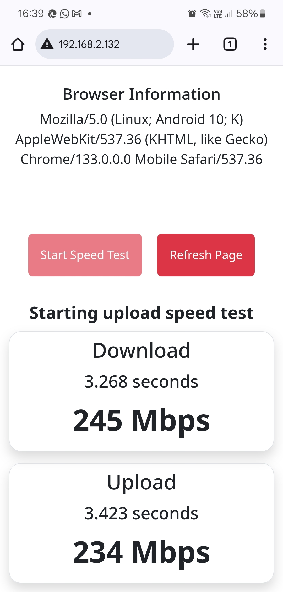

# Local Speed Test Server
A simple speed test server using Python-flash/HTML/Javascript. 
Test bandwidth within your internal network via HTTP/HTTPs. Works on Mobile and Desktop. 
Works on Chrome, Microsoft Edge and Firefox. Not sure if it works on Safari because I don't have a Macbook/iphone.


# Installation
Requirements - Python3, virtual environment, NGINX webserver.

Example - Installation on a fresh Ubuntu 24 server:

1. Create a virtual environment in /var/www/html
```
cd /var/www/html
sudo python3 -m venv lsts
```
2. Download/clone files to the virtual environment directory.
```
cd /var/www/html/lsts
sudo unzip localspeedtest-master.zip
```
3. Install requirements.
```
cd /var/www/html/lsts/bin
sudo ./pip3 install -r ../localspeedtest-master/requirements.txt

cd /var/www/html/
sudo chown -R www-data:www-data lsts/
```
4. Create a systemd file e.g. lsts.service, or use/modify the lsts.service file in the application directory.
5. Copy the lsts.service to /etc/systemd/system
```
cd /var/log/html/lsts/<app-directory>
sudo cp lsts.service /etc/systemd/system/
```
6. Reload systemd
```
sudo systemctl daemon-reload
```
7. Edit the NGINX default virtual server.
```
cd /etc/nginx/sites-available/default
sudo mv default default.bck
sudo nano default
```
```
server {
    listen 80 default_server;

    location / {
    # forwarding traffic to localhhost port 5502 
    proxy_pass http://localhost:5502;
    # increase max body size
    client_max_body_size 2048M;
    include proxy_params;
    }
}
```
8. Test the NGINX configuration.
```
sudo nginx -t
```
9. Start the Local Speed test application and NGINX.
```
sudo systemctl enable --now lsts.service
sudo systemctl enable --now nginx.service
```

# Random data size setting
You can set the random data file size using the url below. Default random data is 100MB.

```
http://< server ip-address>/set_filesize/<size>/
```

where size is between 10 (10MB) and 1000 (1GB).

# Screenshot
